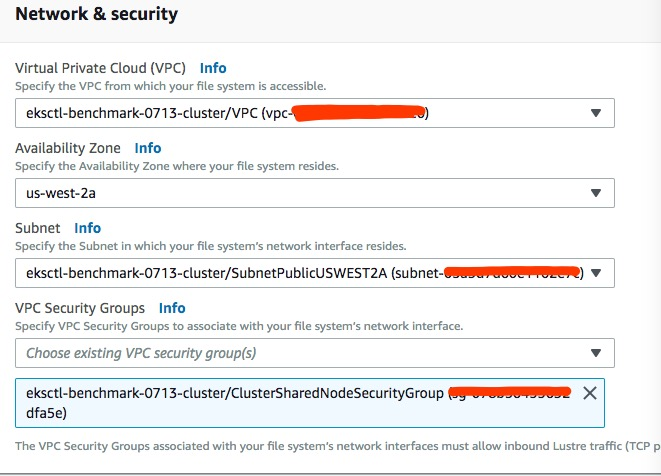
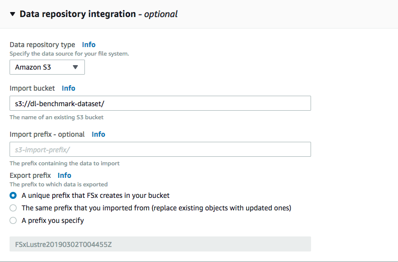

# Distributed Training using TensorFlow and Horovod on Amazon EKS with ImageNet Data

This document explains how to perform distributed training on [Amazon EKS](https://aws.amazon.com/eks/) using TensorFlow and [Horovod](https://github.com/uber/horovod) with [ImageNet dataset](http://www.image-net.org/). The following steps can be ued for any data set though.

## Pre-requisite

1. Create [EKS cluster using GPU with Kubeflow](../../eks-gpu.md).

1. Download and put prepare ImageNet dataset in your S3 bucket like this.

```
➜ aws s3 ls s3://eks-dl-benchmark/imagenet/train/
2019-02-28 12:03:46   56755552 train-00001-of-01024
2019-02-28 12:03:45   56365180 train-00002-of-01024
......
2019-02-28 12:03:45   56365180 train-01024-of-01024


➜ aws s3 ls s3://eks-dl-benchmark/imagenet/validation/
2019-02-28 12:14:10   19504012 validation-00001-of-00128
2019-02-28 12:14:10   19624967 validation-00002-of-00128
....
2019-02-28 12:14:10   20063161 validation-00128-of-00128
```

1. Create an [FSX For Lustre](https://aws.amazon.com/fsx/lustre) and enable data integration with S3. Use the VPC info of the new cluster you created in the first step to create FSX. After you create a FSX for Lustre, you will get a File System Id.

> Note: FSX can only mount to one availability zone, normally we also put all GPU machines in one availability zone. You have to use single availability when you create EKS cluster. Make sure AZ here match with your eksctl worker nodes AZ.




.


## Steps

1. Follow [steps](tensorflow-horovod-synthetic.md#install-mpi-operator) to install mpi-operator

1. Deploy the [Amazon FSx CSI Plugin](https://www.kubeflow.org/docs/aws/storage/#deploy-the-amazon-fsx-csi-plugin).

```
cd ${KUBEFLOW_SRC}/${KFAPP}/ks_app
export COMPONENT=aws-fsx-csi-driver
ks generate aws-fsx-csi-driver ${COMPONENT}
ks apply default -c ${COMPONENT}
```

1. Prepare Persistent Volumne (PV), Persistent Volume Claim (PVC) and Storage Class. Go to FSX console and replace `fsxId` and `dnsName` with your FSX info.

  ```
  cd ${KUBEFLOW_SRC}/${KFAPP}/ks_app
  export COMPONENT=fsx-static-storage

  ks generate aws-fsx-pv-static ${COMPONENT} --fsxId=fs-048xxxx7c25 --dnsName=fs-048xxxx7c25.fsx.us-west-2.amazonaws.com

  ks apply default -c ${COMPONENT}
  ```

1. Prepare training job. Check [here](tensorflow-horovod-synthetic.md#launch-mpi-training-job) for more details

   ```
   export JOB_NAME=tf-resnet50-horovod-job
   ks generate mpi-job-custom ${JOB_NAME}

   ks param set ${JOB_NAME} image "seedjeffwan/eks-dl-benchmark:cuda10-tf1.13.1-hvd0.16.0-py3.5"
   ks param set ${JOB_NAME} replicas 2
   ks param set ${JOB_NAME} gpusPerReplica 4

   EXEC="mpirun,-mca,btl_tcp_if_exclude,lo,-mca,pml,ob1,-mca,btl,^openib,--bind-to,none,-map-by,slot,-x,LD_LIBRARY_PATH,-x,PATH,-x,NCCL_DEBUG=INFO,python,models/resnet/tensorflow/train_imagenet_resnet_hvd.py,--batch_size=256,--model=resnet50,--num_batches=300,--fp16,--display_every=50,--lr_decay_mode=poly,--data_dir=/data/imagenet/train"
   ```
   > Note: Instead of using synthetic data, job will read from `--data_dir`.

1. Right now, `mpi-job-custom` doesn't support volume in jsonnet, we can manually mount volumes.

   ```
   ks show default -c ${JOB_NAME} > /tmp/training_job.yaml
   vim  /tmp/training_job.yaml # add volumes
   ```
   Please check [template](../../samples/imagenet/distributed_training/mpi-job-template-fsx.yaml)

1. Deploy training job
   ```
   ks apply default -c ${JOB_NAME}
   ```

1. Check pod status and logs
    ```
    POD_NAME=$(kubectl -n kubeflow get pods -l mpi_job_name=${JOB_NAME},mpi_role_type=launcher -o name)

    kubectl -n kubeflow logs -f ${POD_NAME}
    ```

    Here is a [sample output](logs/tensorflow-horovod-imagenet-log.txt).

## Appendix

### Download and Pre-process ImageNet Data

If you work for Amazon, then reach out to the authors of this document to have access to the data. Otherwise, follow the instructions below.

1. Download [ImageNet](http://image-net.org/download-images) dataset and upload to your S3 bucket. Use `Download Original Images (for non-commercial research/educational use only)` option.

2. TensorFlow consumes the ImageNet data in a specific format. You can preprocess them by downloading and modifying the script:

    ```
    curl -O https://raw.githubusercontent.com/aws-samples/deep-learning-models/master/utils/tensorflow/preprocess_imagenet.sh
    chmod +x preprocess_imagenet.sh
    ```

    The following values need to be changed:

    * `[your imagenet account]`
    * `[your imagenet access key]`
    * `[PATH TO TFRECORD TRAINING DATASET]`
    * `[PATH TO RESIZED TFRECORD TRAINING DATASET]`
    * `[PATH TO TFRECORD VALIDATION DATASET]`
    * `[PATH TO RESIZED TFRECORD VALIDATION DATASET]`

    Execute the script:

    ```
    ./preprocess_imagenet.sh
    ```
