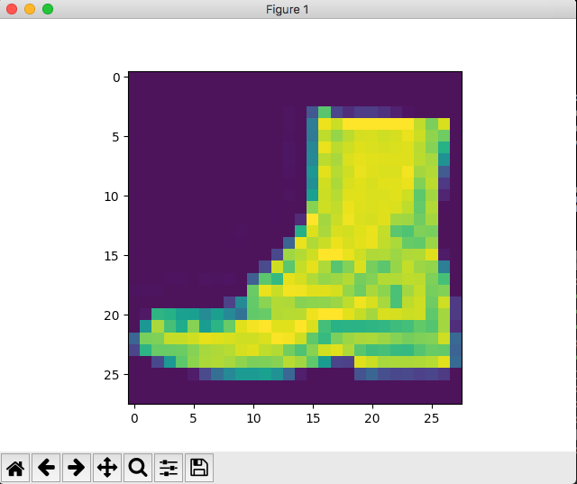

# Inference of MNIST using TensorFlow on Amazon EKS

This document explains how to perform inference of MNIST model using TensorFlow on Amazon EKS.

## Pre-requisite

1. Create [EKS cluster using GPU](../../eks-gpu.md)
2. Install [Kubeflow](../../kubeflow.md)
3. Basic understanding of [TensorFlow Serving](https://www.tensorflow.org/serving/)

## Upload model

1. A pre-trained model is already available at `mnist/serving/tensorflow/model`. This model requires your serving component has GPU. Alternatively, you can generate a model as explained at [Training MNIST using TensorFlow and Keras on Amazon EKS](../training/tensorflow.md).

1. Use an S3 bucket in your region and upload this model:

   ```
   cd samples/mnist/serving/tensorflow/saved_model
   aws s3 sync . s3://your_bucket/mnist/saved_model/
   ```

## Install the TensorFlow Serving component

1. Install TensorFlow Serving pkg:

   ```
   ks pkg install kubeflow/tf-serving
   ```

2. Use [Store AWS Credentials in Kubernetes Secret](aws-credential-secret.md) to configure AWS credentials in your Kubernetes cluster. Remember secret name and data fields.

3. Update `modelBasePath` below to match the S3 bucket name where the model is uploaded. Install Tensorflow Serving AWS Component (Deployment + Service):

   ```
   export TF_SERVING_SERVICE=mnist-service
   export TF_SERVING_DEPLOYMENT=mnist

   ks generate tf-serving-service ${TF_SERVING_SERVICE}
   # match your deployment mode name
   ks param set ${TF_SERVING_SERVICE} modelName ${TF_SERVING_DEPLOYMENT}
   # optional, change type to LoadBalancer to expose external IP.
   ks param set ${TF_SERVING_SERVICE} serviceType ClusterIP

   ks generate tf-serving-deployment-aws ${TF_SERVING_DEPLOYMENT}
   # make sure to match the bucket name used for model
   ks param set ${TF_SERVING_DEPLOYMENT} modelBasePath s3://your_bucket/mnist/export
   ks param set ${TF_SERVING_DEPLOYMENT} s3Enable true
   ks param set ${TF_SERVING_DEPLOYMENT} s3SecretName aws-secret
   ks param set ${TF_SERVING_DEPLOYMENT} s3UseHttps true
   ks param set ${TF_SERVING_DEPLOYMENT} s3VerifySsl true
   ks param set ${TF_SERVING_DEPLOYMENT} s3AwsRegion us-west-2
   ks param set ${TF_SERVING_DEPLOYMENT} s3Endpoint s3.us-west-2.amazonaws.com

   ks param set ${TF_SERVING_DEPLOYMENT} numGpus 1
   ```

4. Deploy Tensorflow Serving components

   ```
   ks apply default -c ${TF_SERVING_SERVICE}
   ks apply default -c ${TF_SERVING_DEPLOYMENT}
   ```

5. Port forward serving endpoint for local testing:

   ```
   kubectl port-forward -n kubeflow `kubectl get pods -n kubeflow --selector=app=mnist -o jsonpath='{.items[0].metadata.name}' --field-selector=status.phase=Running` 8500:8500
   ```

6. Make prediction request. Check serving python client [serving_client.py](../../../samples/mnist/serving/tensorflow/serving_client.py). It will randomly pick one image from test dataset and make prediction. Original datasets are feature vectors and we use `matplotlib` to draw picture to compare results. To run client, please make sure your python client install `tensorflow` and `matplotlib`.

   ```
   $ python serving_client.py --endpoint http://localhost:8500/v1/models/mnist:predic

    Data: {"instances": [[[[0.0], [0.0], [0.0], [0.0], [0.0] ... 0.0], [0.0]]]], "signature_name": "serving_default"}
    The model thought this was a Ankle boot (class 9), and it was actually a Ankle boot (class 9)
   ```

  


   The input is a vector of an image with number 5. The output indicates that the sixth index (starting from 0) has the highest probability.

1. Get serving pod:

   ```
   kubectl get pods -n kubeflow --selector=app=mnist --field-selector=status.phase=Running
   NAME                     READY   STATUS    RESTARTS   AGE
   mnist-7cc4468bc5-wm8kx   1/1     Running   0          2h
   ```

   And then check the logs:

   ```
   kubectl logs mnist-7cc4468bc5-wm8kx -n kubeflow
   ```
