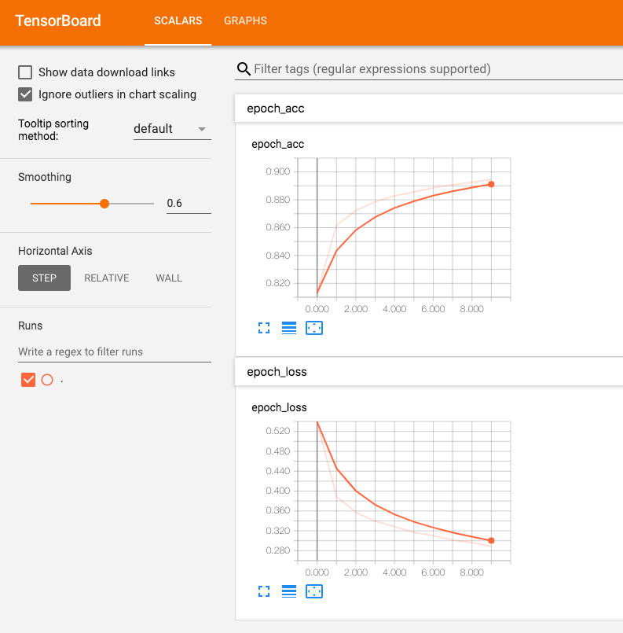

# TensorBoard setup on Amazon EKS

[TensorBoard](https://www.tensorflow.org/guide/summaries_and_tensorboard) helps visualize your TensorFlow graph, plot quantitative metrics about the execution of your graph, and show additional data like images that pass through it.

This document explains how to setup TensorBoard on Amazon EKS.

## Pre-requisite

1. Create [EKS cluster using GPU](eks-gpu.md)
2. Setup [Kubeflow](kubeflow.md)
3. Setup [AWS credential](mnist/inference/aws-credential-secret.md) in Kubernetes cluster. Remember secret name and data fields.

## Steps

1. Install TensorBoard jsonnet package and generate yaml files:

   ```
   # Navigate to ksonnet application folder
   cd ${KUBEFLOW_SRC}/${KFAPP}/ks_app

   export TENSORBOARD_COMPONENT=tensorboard-mnist
   ks pkg install kubeflow/tensorboard
   ks generate tensorboard-aws ${TENSORBOARD_COMPONENT}

   # configure tensorboard log path
   ks param set ${TENSORBOARD_COMPONENT} defaultTbImage tensorflow/tensorflow:1.12.0
   ks param set ${TENSORBOARD_COMPONENT} logDir s3://your_bucket/mnist/summary/

   # configure region and bucket
   ks param set ${TENSORBOARD_COMPONENT} s3Enabled true
   ks param set ${TENSORBOARD_COMPONENT} efsEnabled false
   ks param set ${TENSORBOARD_COMPONENT} s3AwsRegion us-west-2
   ks param set ${TENSORBOARD_COMPONENT} s3Endpoint s3.us-west-2.amazonaws.com

   # configure aws credential
   ks param set ${TENSORBOARD_COMPONENT} s3SecretName aws-secret
   ks param set ${TENSORBOARD_COMPONENT} s3SecretAccesskeyidKeyName AWS_ACCESS_KEY_ID
   ks param set ${TENSORBOARD_COMPONENT} s3SecretSecretaccesskeyKeyName AWS_SECRET_ACCESS_KEY

   # create tensorboard deployment and service
   ks apply default -c ${TENSORBOARD_COMPONENT}
   ```

> Note: To get model training summary, please check [MNIST Training](mnist/training/tensorflow.md)

3. It will create a deployment which runs the TensorBoard on event files. A service is also being created so that user can access tensorboard via browser:

   ```
   kubectl port-forward svc/${TENSORBOARD_COMPONENT} 9000:9000 -n kubeflow
   ```

   

   

4. [OPTIONAL] You can use [AWS Deep Learning Containers](https://aws.amazon.com/machine-learning/containers/) by replacing the lines
   ```
   ks param set ${TENSORBOARD_COMPONENT} defaultTbImage tensorflow/tensorflow:1.12.0
   ```

   to

   ```
   ks param set ${TENSORBOARD_COMPONENT} defaultTbImage 763104351884.dkr.ecr.us-east-1.amazonaws.com/tensorflow-training:1.13-cpu-py27-ubuntu16.04
   ```

   You will need to login to access the repository of the containers by running the command `$(aws ecr get-login --no-include-email --region us-east-1 --registry-ids 763104351884)`

   A full list of images can be found [here](https://docs.aws.amazon.com/dlami/latest/devguide/deep-learning-containers-images.html).
