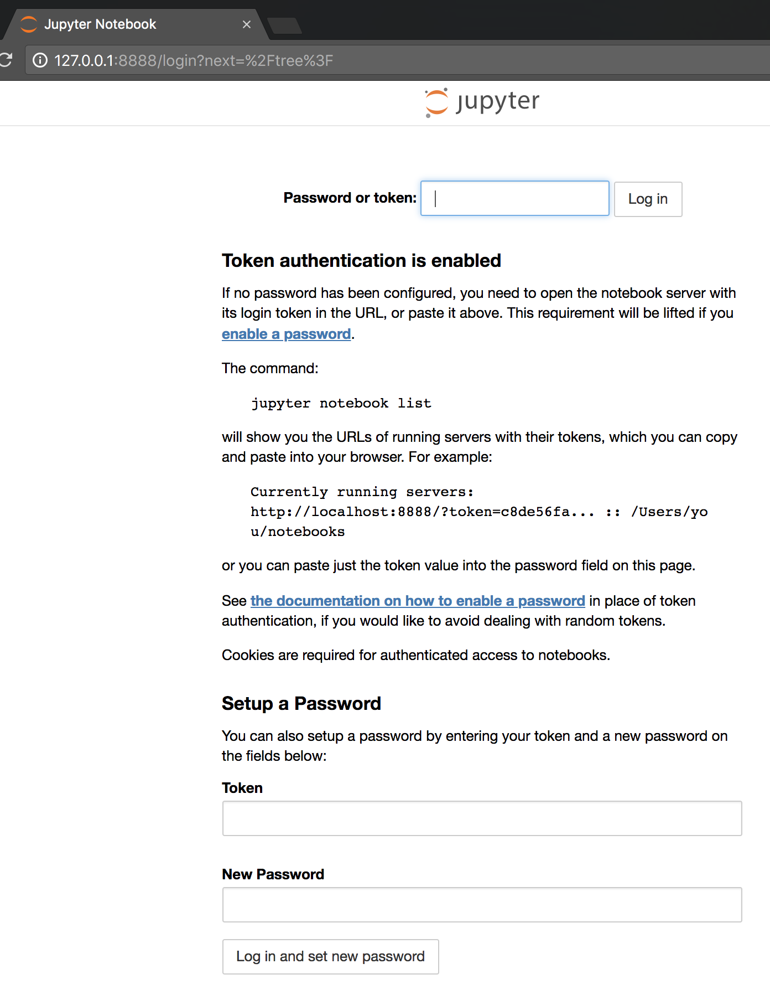
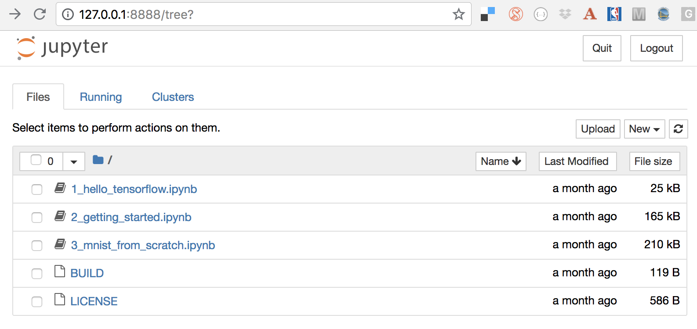
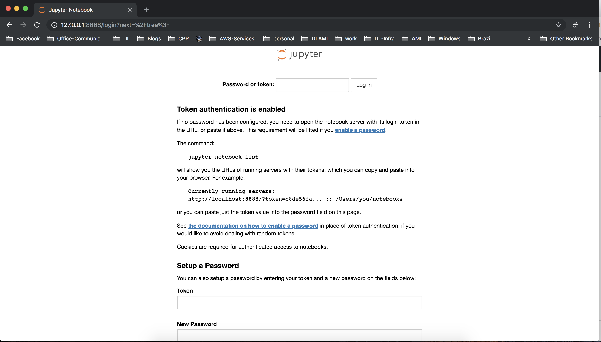
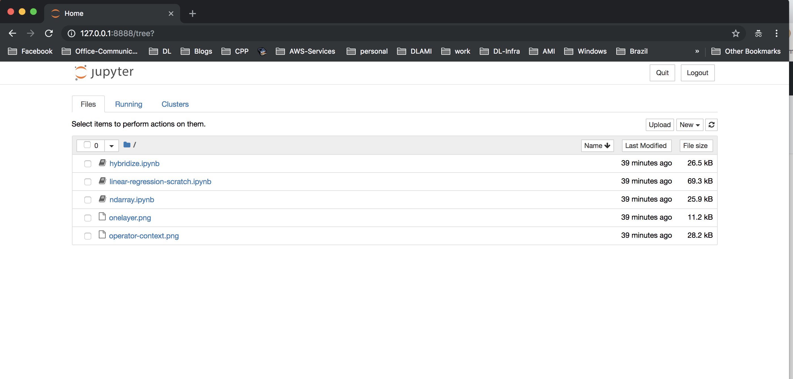
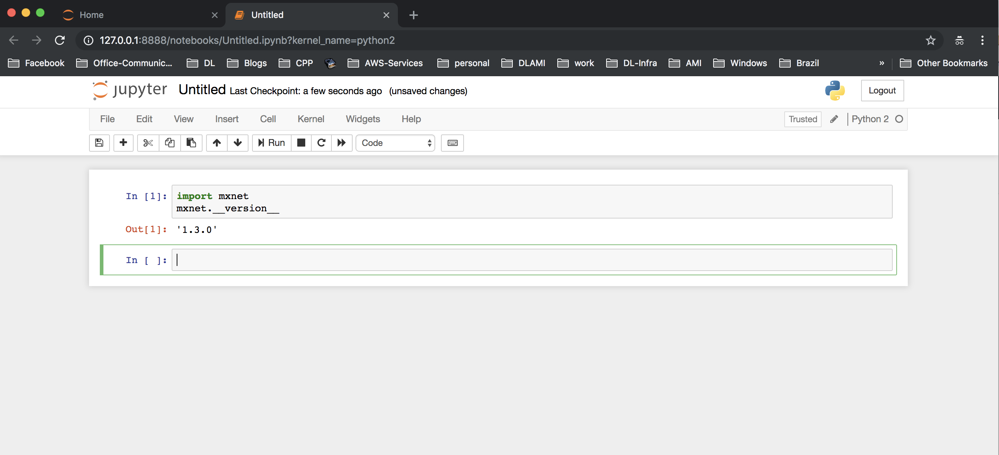

# Jupyter Notebook for TensorFlow on Amazon EKS

This document explains how to run a Jupyter notebook for TensorFlow on [Amazon EKS](https://aws.amazon.com/eks/). 

TensorFlow Docker image has Jupyter notebook installed into it and is started along with the container. The only thing needed was to do a port forwarding and using k8s logs login to jupyter notebook.

1. Create a pod using `samples/notebook/tensorflow/tensorflow.yaml`. It uses the `tensorflow/tensorflow` docker image. 

   ```
   kubectl create -f samples/notebook/tensorflow/tensorflow.yaml
   ```

   Check the logs:

   ```
   kubectl logs tensorflow
   [I 09:52:11.656 NotebookApp] Writing notebook server cookie secret to /root/.local/share/jupyter/runtime/notebook_cookie_secret
   [W 09:52:11.668 NotebookApp] WARNING: The notebook server is listening on all IP addresses and not using encryption. This is not recommended.
   [I 09:52:11.675 NotebookApp] Serving notebooks from local directory: /notebooks
   [I 09:52:11.675 NotebookApp] The Jupyter Notebook is running at:
   [I 09:52:11.675 NotebookApp] http://(tensorflow or 127.0.0.1):8888/?token=eb3cfb04d4c026909ddf5e7ba39a6a26a80780d876b90e93
   [I 09:52:11.675 NotebookApp] Use Control-C to stop this server and shut down all kernels (twice to skip confirmation).
   [C 09:52:11.675 NotebookApp] 
   ```

   The log shows that Jupyter notebook is running.

2. Use port forwarding to access the Jupyter notebook:

   ```
   kubectl port-forward tensorflow 8888:8888
   ```

3. Open `127.0.0.1:8888` in a browser to access the Jupyter notebook. This will ask for a login:

   

   Jupyter notebook is started by the TensorFlow container. The token to login can be obtained from the container logs. Enter the token and click on `Log In`:

   

# Jupyter Notebook for MXNet on Amazon EKS
This document explains how to run a Jupyter notebook for MXNet on [Amazon EKS](https://aws.amazon.com/eks/).

MXNet Docker image does not have jupyter notebook installed into it so we have provided the Dockerfile and MXNet jupyter notebook tutorial. You can build a MXNet docker image which will have jupyter notebook installed as well running during the container launch. To get started we have used our MXNet docker image which has jupyter notebook tutorial as well as it starts once you launch the container. The only thing needed was to do a port forwarding and using k8s logs login to jupyter notebook.

1. Create a pod using `samples/notebook/mxnet/mxnet.yaml`. It uses the `rgaut/deeplearning-mxnet:notebook` docker image.

   ```
   kubectl create -f samples/notebook/mxnet/mxnet.yaml
   ```

   Check the logs:

   ```
   kubectl logs mxnet 
   [I 08:41:06.360 NotebookApp] Writing notebook server cookie secret to /root/.local/share/jupyter/runtime/notebook_cookie_secret
   [I 08:41:06.392 NotebookApp] Serving notebooks from local directory: /mxnet-tutorial
   [I 08:41:06.392 NotebookApp] The Jupyter Notebook is running at:
   [I 08:41:06.392 NotebookApp] http://127.0.0.1:8888/?token=da78d77f5b4e420d7b8bedab208c3ac671392bc0ad3f424c
   [I 08:41:06.392 NotebookApp] Use Control-C to stop this server and shut down all kernels (twice to skip confirmation).
   ```

   The log shows that Jupyter notebook is running.

2. Use port forwarding to access the Jupyter notebook:

   ```
   kubectl port-forward mxnet 8888:8888
   ```

3. Open `127.0.0.1:8888` in a browser to access the Jupyter notebook. This will ask for a login:

   

   Jupyter notebook is started by the MXNet container. The token to login can be obtained from the container logs. Enter the token and click on `Log In`:

   

   You can create some custom notebook like below
 
   

