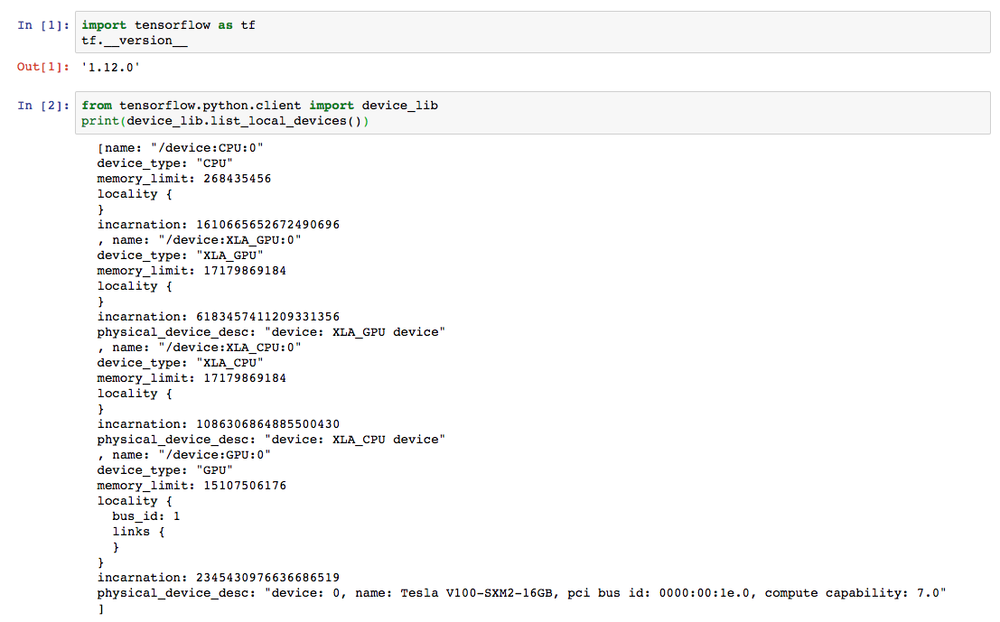

# Jupyter Notebook on Amazon EKS

This document explains how to run a Jupyter notebook for model development on [Amazon EKS](https://aws.amazon.com/eks/). 

Jupyter Notebook (previously named IPython Notebook) and JupyterLab are user interfaces for computational science and data science commonly used with Spark, Tensorflow and other big data processing frameworks. They are used by data scientists and ML engineers across a variety of organizations for interactive tasks.

JupyterHub lets users manage authenticated access to multiple single-user Jupyter notebooks. 

Kubeflow already integrate wtih JupyterHub and the only thing needed was to do a port forwarding and spawn a Jupyter Notebook. 

1. Get access to Kubeflow UI

   ```
   export NAMESPACE=kubeflow
   kubectl port-forward svc/ambassador -n ${NAMESPACE} 8080:80
   ```
   
   Now you can access the central navigation dashboard at
   ```
   http://localhost:8080/
   ```

2. Click JupyterHub tab and sign in. Right now, EKS doesn't integrate authentication solution with JupyterHub, you can type any username and password combination to bypass authentication. Use `admin` as the login name and `admin` as the password.

4. Configure Spawner

   a. Choose the right framework image. if you prefer to use other framework like MXNet, PyTorch, you can also build your own image. Let's choose `gcr.io/kubeflow-images-public/tensorflow-1.12.0-notebook-gpu:v0.4.0`

   b. Click `Toggle Advanced` to advanced settings.
     - Add Workpace volume if you need perisist your workplace notebooks after jupyter notebook destroyed.
     - Add Data Volumes if you want to train with large datasets.
     - Add GPU resources if your cluster has accelerator nodes and GPU image is choosen.
     

5. Click `Spawn` button to create your customized Jupyter notebook. This may take few minutes. Debug new spawned pods:

   ```
   kubectl -n ${NAMESPACE} describe pods jupyter-admin
   ```

   It will shown an output:

   ```
   Name:               jupyter-admin
   Namespace:          kubeflow
   Priority:           0
   PriorityClassName:  <none>
   Node:               ip-192-168-17-245.us-west-2.compute.internal/192.168.17.245
   Start Time:         Sun, 17 Mar 2019 16:25:25 -0400
   Labels:             app=jupyterhub
                       component=singleuser-server
                       heritage=jupyterhub
   Annotations:        hub.jupyter.org/username: admin
   Status:             Running
   IP:                 192.168.27.152
   Containers:
     notebook:
       Container ID:  docker://1a907dfaf127a3c1a2e961880bca86c15ef2ea22e6ca51f8a16004cef70da1d0
       Image:         gcr.io/kubeflow-images-public/tensorflow-1.12.0-notebook-gpu:v0.4.0
       Image ID:      docker-pullable://gcr.io/kubeflow-images-public/tensorflow-1.12.0-notebook-gpu@sha256:d9176e3740a69e516b5029e669ddb353ab7a45ebe7f9c1c8cc339e92b7395647
       Port:          8888/TCP
       Host Port:     0/TCP
       Args:
         start-singleuser.sh
         --ip="0.0.0.0"
         --port=8888
         --allow-root
       State:          Running
         Started:      Sun, 17 Mar 2019 16:27:32 -0400
       Ready:          True
       Restart Count:  0
       Limits:
         nvidia.com/gpu:  1
       Requests:
         cpu:             1
         memory:          1Gi
         nvidia.com/gpu:  1
       Environment:
         JUPYTERHUB_API_TOKEN:           26af6c6442c64dcb90f683b4edd07f39
         JPY_API_TOKEN:                  26af6c6442c64dcb90f683b4edd07f39
         JUPYTERHUB_CLIENT_ID:           jupyterhub-user-admin
         JUPYTERHUB_HOST:                
         JUPYTERHUB_OAUTH_CALLBACK_URL:  /user/admin/oauth_callback
         JUPYTERHUB_USER:                admin
         JUPYTERHUB_API_URL:             http://jupyter-0:8081/hub/api
         JUPYTERHUB_BASE_URL:            /
         JUPYTERHUB_SERVICE_PREFIX:      /user/admin/
         MEM_GUARANTEE:                  1.0Gi
         CPU_GUARANTEE:                  1.0
       Mounts:
         /home/jovyan from volume-0-admin (rw)
         /home/jovyan/admin-volume-1 from volume-1-admin (rw)
         /var/run/secrets/kubernetes.io/serviceaccount from jupyter-notebook-token-n2fgf (ro)
   Conditions:
     Type              Status
     Initialized       True 
     Ready             True 
     ContainersReady   True 
     PodScheduled      True 
   Volumes:
     volume-0-admin:
       Type:       PersistentVolumeClaim (a reference to a PersistentVolumeClaim in the same namespace)
       ClaimName:  admin-workspace
       ReadOnly:   false
     volume-1-admin:
       Type:       PersistentVolumeClaim (a reference to a PersistentVolumeClaim in the same namespace)
       ClaimName:  admin-volume-1
       ReadOnly:   false
     jupyter-notebook-token-n2fgf:
       Type:        Secret (a volume populated by a Secret)
       SecretName:  jupyter-notebook-token-n2fgf
       Optional:    false
   QoS Class:       Burstable
   Node-Selectors:  <none>
   Tolerations:     node.kubernetes.io/not-ready:NoExecute for 300s
                    node.kubernetes.io/unreachable:NoExecute for 300s
   Events:
     Type     Reason                  Age                    From                                                   Message
     ----     ------                  ----                   ----                                                   -------
     Warning  FailedScheduling        4m53s (x9 over 4m56s)  default-scheduler                                      pod has unbound immediate PersistentVolumeClaims (repeated 2 times)
     Normal   Scheduled               4m53s                  default-scheduler                                      Successfully assigned kubeflow/jupyter-admin to ip-192-168-17-245.us-west-2.compute.internal
     Warning  FailedAttachVolume      4m52s (x2 over 4m52s)  attachdetach-controller                                AttachVolume.Attach failed for volume "pvc-ca405a39-48f2-11e9-a4bb-0a9a747311bc" : "Error attaching EBS volume \"vol-03affb8dd7a89e798\"" to instance "i-0e5baf0b5de72611d" since volume is in "creating" state
     Warning  FailedAttachVolume      4m48s (x4 over 4m52s)  attachdetach-controller                                AttachVolume.Attach failed for volume "pvc-ca3edf7d-48f2-11e9-a4bb-0a9a747311bc" : "Error attaching EBS volume \"vol-001a0ebf3f29ef982\"" to instance "i-0e5baf0b5de72611d" since volume is in "creating" state
     Normal   SuccessfulAttachVolume  4m47s                  attachdetach-controller                                AttachVolume.Attach succeeded for volume "pvc-ca405a39-48f2-11e9-a4bb-0a9a747311bc"
     Normal   SuccessfulAttachVolume  4m41s                  attachdetach-controller                                AttachVolume.Attach succeeded for volume "pvc-ca3edf7d-48f2-11e9-a4bb-0a9a747311bc"
     Normal   Pulling                 4m35s                  kubelet, ip-192-168-17-245.us-west-2.compute.internal  pulling image "gcr.io/kubeflow-images-public/tensorflow-1.12.0-notebook-gpu:v0.4.0"
     Normal   Pulled                  3m6s                   kubelet, ip-192-168-17-245.us-west-2.compute.internal  Successfully pulled image "gcr.io/kubeflow-images-public/tensorflow-1.12.0-notebook-gpu:v0.4.0"
     Normal   Created                 2m46s                  kubelet, ip-192-168-17-245.us-west-2.compute.internal  Created container
     Normal   Started                 2m46s                  kubelet, ip-192-168-17-245.us-west-2.compute.internal  Started container
  ```

6. Once your server starts up. Verify docker image working properly.
   
   Check Tensorflow version
   ```
   import tensorflow as tf
   tf.__version__
   ```

   Check GPU allocated to Jupyter Notebook:

   ```
   from tensorflow.python.client import device_lib
   print(device_lib.list_local_devices())
   ```

   

   Create a terminal to monitor nvidia device
   ```
   $ nvidia-smi
   Mon Feb 11 19:46:02 2019
   +-----------------------------------------------------------------------------+
   | NVIDIA-SMI 396.26                 Driver Version: 396.26                    |
   |-------------------------------+----------------------+----------------------+
   | GPU  Name        Persistence-M| Bus-Id        Disp.A | Volatile Uncorr. ECC |
   | Fan  Temp  Perf  Pwr:Usage/Cap|         Memory-Usage | GPU-Util  Compute M. |
   |===============================+======================+======================|
   |   0  Tesla V100-SXM2...  On   | 00000000:00:1E.0 Off |                    0 |
   | N/A   41C    P0    39W / 300W |    994MiB / 16160MiB |      0%      Default |
   +-------------------------------+----------------------+----------------------+

   +-----------------------------------------------------------------------------+ 
   | Processes:                                                       GPU Memory |
   |  GPU       PID   Type   Process name                             Usage      |
   |=============================================================================|
   +-----------------------------------------------------------------------------+
   ```

7. After done playing, destroy your notebook.

   One user can only have one Jupyter Notebook running. In order to use a different notebook or destroy your notebook, you have to stop existing server first.  
   Click `Control Panel` button on the right top of Jupyter Notebook. Click `Stop My Server` button to destroy the server.

   > Note: Persistent Volume won't be deleted in case you want to restore your notebooks.

