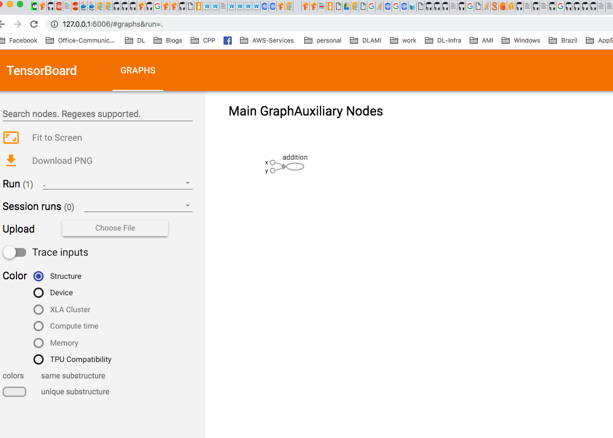

# TensorBoard setup on Amazon EKS 
This document explains how to setup TensorBoard on [Amazon EKS](https://aws.amazon.com/eks/).

## Prerequisite
1. Create [EKS cluster using GPU](eks-gpu.md)
2. Setup [Kubeflow](kubeflow.md)

## Steps 

1. A kubernetes secret containing S3 credentials is needed to get access to tensorboard event files on S3. 
  
   You can check your credentails
   ```
   $ cat ~/.aws/credentials
   [default]
   aws_access_key_id = FAKEAWSACCESSKEYID
   aws_secret_access_key = FAKEAWSSECRETACCESSKEY
   ```
   The secret data feild is used to store arbitrary data, encoded using base64.

   ```
   $ echo -n 'FAKEAWSACCESSKEYID' | base64
   RkFLRUFXU0FDQ0VTU0tFWUlE
  
   $ echo -n 'FAKEAWSSECRETACCESSKEY' | base64
   RkFLRUFXU1NFQ1JFVEFDQ0VTU0tFWQ==
   ```

   Create a secret yaml file and apply it `kubectl -n kubeflow apply secret.yaml`

   ```
   apiVersion: v1
   kind: Secret
   metadata:
     name: aws-s3-secret
   type: Opaque
   data:
     access_key_id: RkFLRUFXU0FDQ0VTU0tFWUlE
     secret_access_key: RkFLRUFXU1NFQ1JFVEFDQ0VTU0tFWQ==
   ```

3. Install tensorboard jsonnet package and generate yaml files. 

   ```
   export TENSORBOARD_COMPONENT=tensorboard-mnist
   ks pkg install kubeflow/tensorboard
   ks generate tensorboard-aws ${TENSORBOARD_COMPONENT}

   # configure tensorboard log path
   ks param set ${TENSORBOARD_COMPONENT} defaultTbImage tensorflow/tensorflow:1.12.0
   ks param set ${TENSORBOARD_COMPONENT} logDir s3://eks-kubeflow-example/tensorflow_logs/mnist/

   # confirure region and bucket
   ks param set ${TENSORBOARD_COMPONENT} s3AwsRegion tensorflow/tensorflow:1.12.0
   ks param set ${TENSORBOARD_COMPONENT} s3Endpoint tensorflow/tensorflow:1.12.0
   ks param set ${TENSORBOARD_COMPONENT} s3UseHttps tensorflow/tensorflow:1.12.0
   ks param set ${TENSORBOARD_COMPONENT} s3VerifySsl tensorflow/tensorflow:1.12.0

   # configure aws credential
   ks param set ${TENSORBOARD_COMPONENT} s3SecretName aws-s3-secret
   ks param set ${TENSORBOARD_COMPONENT} s3SecretAccesskeyidKeyName access_key_id
   ks param set ${TENSORBOARD_COMPONENT} s3SecretSecretaccesskeyKeyName secret_access_key

   # create tensorboard deployment and service
   ks apply default -c ${TENSORBOARD_COMPONENT} 
   ```

2. It will create a deployment which runs the tensorboard on event files. A service is also being created so that user can access tensorboard via browser
   ```
   kubectl port-forward svc/${TENSORBOARD_COMPONENT} 9000:9000
   ```
   